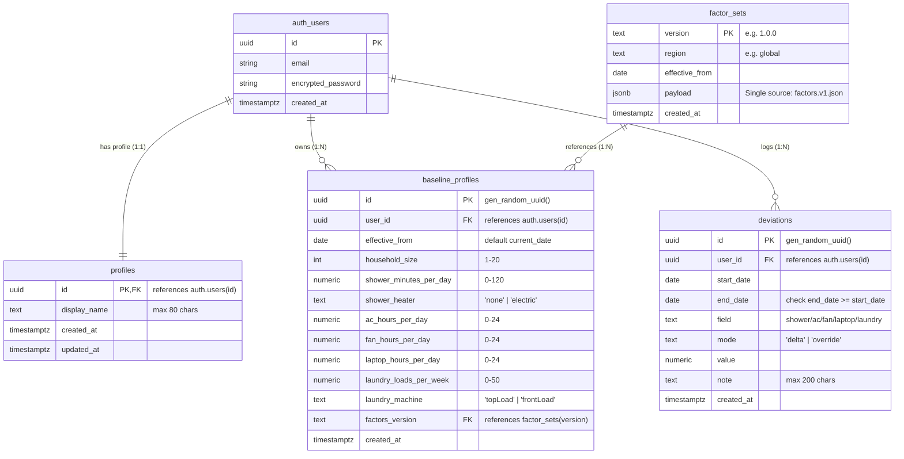

# Resource Footprint - System Architecture

This document describes the architectural foundations, database schema, security model, and service layer established in Phase 2.

---

## 1. Entity-Relationship Diagram (ERD)



---

## 2. Row-Level Security (RLS) Policy Matrix

All public schema tables enforce RLS. Granular, single-operation policies ensure optimal query planner performance via `(select auth.uid())`.

| Table | Role | SELECT | INSERT | UPDATE | DELETE | Policy Details |
| :--- | :--- | :---: | :---: | :---: | :---: | :--- |
| **`profiles`** | `anon` | ❌ Denied | ❌ Denied | ❌ Denied | ❌ Denied | Privileges revoked |
| | `authenticated` | ✅ Own row | ❌ Denied | ✅ Own row | ❌ Denied | Managed via `auth.users` trigger; client insert/delete disallowed |
| **`factor_sets`** | `anon` | ✅ Allowed | ❌ Denied | ❌ Denied | ❌ Denied | Simulator accessible pre-signup; immutable |
| | `authenticated` | ✅ Allowed | ❌ Denied | ❌ Denied | ❌ Denied | Read-only; new versions added via migrations only |
| **`baseline_profiles`**| `anon` | ❌ Denied | ❌ Denied | ❌ Denied | ❌ Denied | Privileges revoked |
| | `authenticated` | ✅ Own rows | ✅ `WITH CHECK` | ✅ `WITH CHECK` | ✅ Own rows | `user_id = (select auth.uid())` strictly enforced |
| **`deviations`** | `anon` | ❌ Denied | ❌ Denied | ❌ Denied | ❌ Denied | Privileges revoked |
| | `authenticated` | ✅ Own rows | ✅ `WITH CHECK` | ✅ `WITH CHECK` | ✅ Own rows | `user_id = (select auth.uid())` strictly enforced |

---

## 3. Baseline Versioning & Append-Only History

1. **Reproducibility**:
   Past resource consumption must remain reproducible even after habits change. Updating a baseline never overwrites previous historical baselines.
2. **Effective Date Semantics**:
   - Each baseline row records `effective_from DATE`.
   - A unique constraint enforces `UNIQUE (user_id, effective_from)`.
   - The user's **current** baseline is defined as:
     ```sql
     select * from baseline_profiles
     where user_id = auth.uid() and effective_from <= current_date
     order by effective_from desc
     limit 1;
     ```
   - Modifying habits for today upserts today's row; modifying habits historically creates a new effective entry.

---

## 4. Single Source of Truth for Conversion Factors

1. **`src/data/factors.v1.json`**:
   The authoritative, human-readable specification of conversion factors and empirical sources.
2. **`scripts/generate-factor-seed.ts`**:
   Validates JSON structure, types, and invariant `low <= typical <= high` before generating `supabase/seed.sql`.
3. **Database Immobility**:
   The `public.factor_sets` table has no `UPDATE` or `DELETE` policies for any role. Published factors are immutable.

---

## 5. Service Layer & The `Result` Pattern

To prevent unhandled promise rejections and keep the UI decoupled from raw Postgres/Supabase exceptions:

```typescript
export type Result<T, E = ServiceError> =
  | { ok: true; data: T; error?: never }
  | { ok: false; error: E; data?: never };

export interface ServiceError {
  code: 'UNAUTHENTICATED' | 'VALIDATION' | 'NOT_FOUND' | 'NETWORK' | 'UNKNOWN';
  message: string;
  details?: Record<string, string> | unknown;
}
```

### Pre-Validation Guarantee
Repositories validate domain constraints against `PROFILE_BOUNDS` via the pure calculation engine (`validateProfile`) **before** invoking the database. Out-of-bounds requests return a structured `VALIDATION` error immediately without incurring network latency.

---

## 6. Security Principles

- **Zero Client Service Role Key**: Only the `anon` / public key is bundled in the frontend. The `service_role` key never enters `src/`, `dist/`, or any environment accessible by client code.
- **Strict Environment Separation**: Secrets and sensitive overrides live only in `.env.local`, which is strictly gitignored. `.env.example` provides non-sensitive placeholders.
- **Granular Database Privileges**: Anonymous users are explicitly revoked access from all personal data tables.


---

## 7. Frontend Structure & Design System

### Layering & Separation of Concerns
1. **Pages (`src/pages/`)**: Route entry points (`LandingPage.tsx`, `NotFoundPage.tsx`).
2. **Components (`src/components/`)**:
   - `layout/`: App shell, navigation header, accessible skip-to-content link, footer, and theme switcher.
   - `simulator/`: Presentational components for the What-If Simulator (`BaselinePanel`, `ScenarioPanel`, `ResultsPanel`, `SavingsCard`, `ComparisonBars`, `SummaryCard`, `PeriodToggle`, `NumberField`, `TrustBanner`).
3. **Hooks (`src/hooks/`)**:
   - `useSimulatorState.ts`: Manages baseline & scenario state, debounced screen-reader announcements, prefill logic, and URL query synchronization.
   - `useTheme.ts`: Handles `light`, `dark`, and `system` preferences with localStorage persistence and `prefers-color-scheme` listeners.
   - `useAnimatedNumber.ts`: Smooth number transitions via `requestAnimationFrame` under 400ms, disabled automatically when `prefers-reduced-motion` is detected.
4. **Pure Libraries (`src/lib/`)**:
   - `format.ts`: Outward-rounded intervals (lower bounds floored, upper bounds ceiled) and 2-3 significant figure formatters.
   - `summary.ts`: Generates single-sentence summaries highlighting the dominant habit lever by running isolated `compareProfiles` runs.
   - `urlState.ts`: Pure serialization and validated parsing of URL search parameters.
5. **Engine Purity Guarantee**:
   The What-If Simulator is completely **stateless and engine-driven**. All calculations, comparisons, and period conversions are executed through `@/engine`. Components never calculate raw water or energy consumption directly.

### Semantic Theme Tokens
Styling is configured in `tailwind.config.js` and `src/index.css` using HSL CSS variables:
- `surface` / `surface-raised` / `surface-subtle`: Warm sand and crisp elevated card backgrounds in light mode; deep midnight slate tones in dark mode.
- `ink` / `ink-muted`: High-contrast typography with accessible contrast ratios.
- `border`: Subtle structural dividers.
- `primary` / `primary-hover`: Deep forest green.
- `accent`: Crisp teal.
- `water` / `water-bg`: Blue shades dedicated exclusively to water usage across all screens.
- `energy` / `energy-bg`: Amber shades dedicated exclusively to energy consumption across all screens.
- `positive` / `negative`: Semantic status indicators, always paired with explicit icons and descriptive text to avoid relying on color alone.
